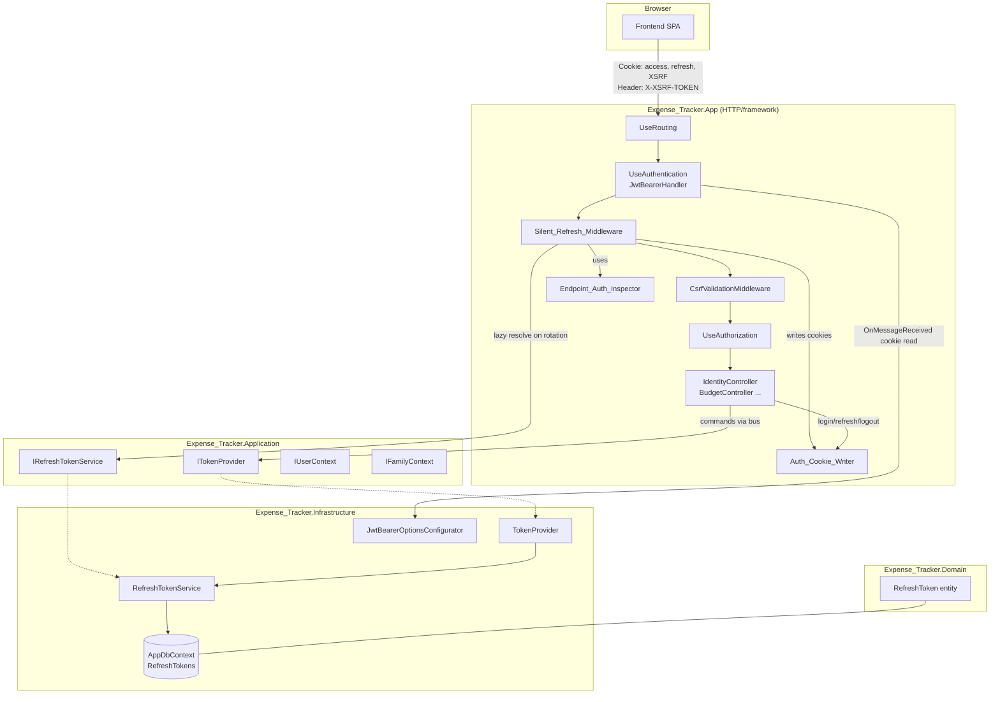
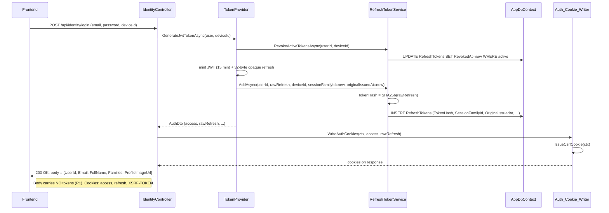
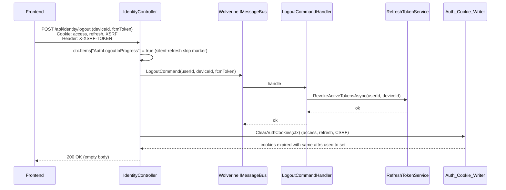
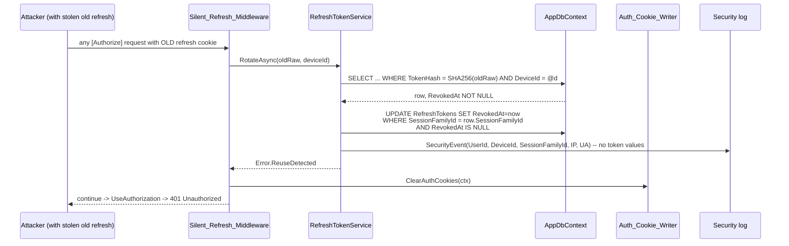

# Design Document: Cookie-Based Auth Refactor

## Overview

This design moves TrackWallet's authentication tokens from JSON response bodies into HttpOnly cookies, adds a silent refresh middleware that keeps sessions alive transparently, hashes refresh tokens with SHA-256, introduces session families with reuse detection, enforces sliding expiration bounded by an absolute maximum, and adds CSRF defenses via ASP.NET Core `IAntiforgery`.

The refactor is constrained to keep the existing controller surface untouched: `[Authorize]`/`[AllowAnonymous]` attributes, `RequireFamilyAttribute`/`RequireParentRoleAttribute` filters, the `IUserContext` (`HttpUserContext`) and `IFamilyContext` (`HttpFamilyContext`) contracts, and the `ClaimsPrincipal` claim shape produced by `TokenProvider.BuildClaims` all remain exactly as they are today. Only the transport layer (cookies vs. JSON), the token storage layer (hashed vs. plaintext), and a new request-pipeline stage (silent refresh + CSRF) change.

**Layer assignment.** Following Clean Architecture discipline already in place (`Domain` → `Application` → `Infrastructure`/`App`):

- **App layer** (`Expense_Tracker.App`): `Auth_Cookie_Writer`, `Silent_Refresh_Middleware`, `Endpoint_Auth_Inspector`, `CsrfValidationMiddleware`, options classes (`AuthCookieOptions`, `CsrfOptions`), startup-time cookie security validator.
- **Application layer** (`Expense_Tracker.Application`): `ITokenProvider`, `IRefreshTokenService`, DTOs. Signatures are extended (not leaked) to carry `SessionFamilyId` and `OriginalIssuedAt` where required by use cases. Request contract (`RefreshTokenRequest`) loses its `RefreshToken` field.
- **Infrastructure layer** (`Expense_Tracker.Infrastructure`): `TokenProvider` (mint + opaque refresh token generation), `RefreshTokenService` (SHA-256 hash, atomic rotation, reuse detection), `JwtBearerOptionsConfigurator` (cookie-only read, clock-skew aware), `RefreshTokenConfiguration` (new columns/indexes), EF migration.
- **Domain layer** (`Expense_Tracker.Domain.Common.Identity`): `RefreshToken` entity gains `TokenHash`, `SessionFamilyId`, `ReplacedByTokenId`, `OriginalIssuedAt`.

> Satisfies: **R17** (clean architecture, option binding pattern matches `JwtSettings`/`OtpSettings`).

**Client surface.** The backend serves a single browser-based web frontend. There are no mobile clients, no external OAuth controller, and no non-browser consumers. This lets the design commit fully to cookies as the only authentication transport — the `Authorization: Bearer` header is no longer read by the JWT handler (see `JwtBearerOptionsConfigurator` below).

**Frontend contract.** Responses of `POST /api/identity/login` and `POST /api/identity/refresh` no longer carry `JwtToken` or `RefreshToken` fields. The browser receives the access token, refresh token, and CSRF token as cookies; the frontend must call fetch/axios with `credentials: "include"` and echo the `X-XSRF-TOKEN` header on all unsafe methods. See §12 Backward Compatibility and §13 Testing Strategy.

> Satisfies: **R1**, **R20**.

---

## Architecture

### Component diagram



> Satisfies: **R17.1–R17.6** (component placement across layers, no new cross-layer deps).

### Request pipeline ordering

The new pipeline is, in order:

```
UseRouting
  -> UseCors("AllowFrontend")          // explicit origins + AllowCredentials
  -> UseAuthentication                 // JwtBearerHandler reads cookie (R4)
  -> UseMiddleware<Silent_Refresh_Middleware>   // runs only for [Authorize] endpoints, rotates if within threshold
  -> UseMiddleware<CsrfValidationMiddleware>    // validates X-XSRF-TOKEN for unsafe + authorized
  -> UseAuthorization                  // [Authorize] evaluated against the (possibly just-refreshed) principal
  -> MapControllers
```

**Rationale.**
- `UseAuthentication` must precede silent refresh: the middleware inspects the authenticated principal and decides whether to refresh based on the *current* access token's `exp`. If the access token is present and still within threshold, no rotation happens; if the access token is absent or expired and the refresh cookie is valid, the middleware rotates and replaces `HttpContext.User` before `UseAuthorization` runs.
- Silent refresh must precede CSRF validation, because a rotation must not be blocked by a CSRF check (the rotation happens server-side with no client body) — but CSRF still applies to the *business* request that triggered the pipeline.
- CSRF must precede `UseAuthorization` so that a 403 from CSRF failure short-circuits before any controller action runs.
- `MapControllers` runs last; by the time a controller action executes, the principal is stable and CSRF has passed.

> Satisfies: **R17.2**, **R5**, **R6**, **R12**, **R18.6**.

### Login flow



> Satisfies: **R1**, **R2**, **R3**, **R9.1–R9.5**, **R12.2**, **R22**.

### Authenticated request with silent refresh

```mermaid
sequenceDiagram
    participant FE as Frontend
    participant AUTHN as JwtBearerHandler
    participant SRM as Silent_Refresh_Middleware
    participant INSP as Endpoint_Auth_Inspector
    participant RTS as RefreshTokenService
    participant CW as Auth_Cookie_Writer
    participant CTRL as Controller

    FE->>AUTHN: GET /api/budgets (Cookie: access, refresh, XSRF)<br/>Header: X-XSRF-TOKEN
    AUTHN->>AUTHN: OnMessageReceived -> ctx.Token = cookie
    alt access token valid & above threshold
        AUTHN-->>SRM: principal set
        SRM->>INSP: RequiresAuthorization(ctx)?
        INSP-->>SRM: yes
        SRM->>SRM: remainingLifetime > threshold -> pass
        SRM-->>CTRL: continue (no DB)
    else access token within threshold OR expired but valid refresh
        SRM->>INSP: RequiresAuthorization(ctx)?
        INSP-->>SRM: yes
        SRM->>SRM: check per-request marker; check grace cache
        alt grace cache hit
            SRM->>CW: WriteAccessCookie(cachedAccess)<br/>WriteRefreshCookie(cachedRefresh)
        else miss
            SRM->>RTS: RotateAsync(rawRefreshFromCookie, deviceId)
            RTS->>RTS: hash; SELECT FOR UPDATE; verify active; revoke; INSERT new with same SessionFamilyId, same OriginalIssuedAt
            RTS-->>SRM: (newAccess, newRawRefresh)
            SRM->>SRM: cache (oldHash -> new pair) for 10s
            SRM->>CW: WriteAccessCookie + WriteRefreshCookie + RefreshCsrfCookie
        end
        SRM->>SRM: replace HttpContext.User with new principal
        SRM-->>CTRL: continue
    end
    CTRL-->>FE: 200 OK (business response)
```

> Satisfies: **R5**, **R6**, **R7**, **R8**, **R11**, **R13**, **R19**.

### Logout flow



> Satisfies: **R14**, **R21.3**.

### Reuse-attack detection



> Satisfies: **R10**, **R18.4**, **R21.2**.

---

## Components and Interfaces

### `Auth_Cookie_Writer` (App layer)

Single source of truth for every authentication-related cookie. Lives at `Expense_Tracker.App/Auth/AuthCookieWriter.cs`. Registered as `IScopedService`.

```csharp
namespace Expense_Tracker.App.Auth;

public interface IAuthCookieWriter
{
    void WriteAccessCookie(HttpContext ctx, string accessToken, DateTimeOffset expiresAt);
    void WriteRefreshCookie(HttpContext ctx, string rawRefreshToken, DateTimeOffset expiresAt);
    void IssueCsrfCookie(HttpContext ctx); // sets non-HttpOnly XSRF-TOKEN
    void RefreshCsrfCookie(HttpContext ctx); // idempotent; re-sets if missing/stale
    void ClearAuthCookies(HttpContext ctx); // access + refresh + CSRF using same attrs as set
    // Returned for startup validation only; never consumed by middleware.
    IReadOnlyList<AuthCookieDescriptor> GetRegisteredDescriptors();
}

public sealed record AuthCookieDescriptor(
    string Name,
    bool HttpOnly,
    bool Secure,
    SameSiteMode SameSite,
    string Path,
    string? Domain);

public sealed class AuthCookieWriter(
    IOptionsMonitor<AuthCookieOptions> cookieOpts,
    IOptionsMonitor<CsrfOptions> csrfOpts,
    IWebHostEnvironment env,
    IAntiforgery antiforgery) : IAuthCookieWriter, IScopedService
{
    // Builds CookieOptions from AuthCookieOptions + environment.
    // Development Secure=false ONLY when cookieOpts.AllowInsecureInDevelopment == true.
    // All call sites — login, refresh, silent refresh, logout, reuse-detection cleanup —
    // go through this class. Controllers and middleware MUST NOT call
    // Response.Cookies.Append/Delete directly for auth-related cookie names.
}
```

Key invariants (enforced by this class, validated at startup — see §5):
- `HttpOnly=true` on access and refresh cookies; `HttpOnly=false` only on the CSRF cookie.
- `Secure=true` always, except in Development when `AuthCookieOptions.AllowInsecureInDevelopment = true`.
- `SameSite` defaults to `Strict`, configurable per cookie.
- `Path` and `Domain` are always explicit from configuration — never framework defaults.
- `Expires` / `Max-Age` equals the token's `exp` (access) or rotation-extended expiry (refresh).
- Access and refresh cookie **names** differ and are configurable.
- Refresh cookie `Path` is scoped to `/api/identity` (at minimum) to limit cross-route leakage.
- Clearing uses identical `Name`/`Path`/`Domain`/`Secure`/`SameSite`/`HttpOnly` as setting, so browsers actually delete.

> Satisfies: **R2.1–R2.5**, **R3.1–R3.5**, **R12.2**, **R12.6**, **R14.2**, **R17.1**, **R22.1–R22.10**.

### `Silent_Refresh_Middleware` (App layer)

Lives at `Expense_Tracker.App/Auth/SilentRefreshMiddleware.cs`. Registered via `app.UseMiddleware<SilentRefreshMiddleware>()` between `UseAuthentication` and `UseMiddleware<CsrfValidationMiddleware>`.

```csharp
public sealed class SilentRefreshMiddleware
{
    private const string MarkerKey = "__trackwallet_silent_refresh_ran";
    private const string LogoutSkipKey = "AuthLogoutInProgress"; // set by LogoutController

    private readonly RequestDelegate _next;
    private readonly IOptionsMonitor<JwtSettings> _jwtOpts;
    private readonly IOptionsMonitor<AuthCookieOptions> _cookieOpts;
    private readonly IMemoryCache _graceCache;            // singleton
    private readonly ILogger<SilentRefreshMiddleware> _log;

    public SilentRefreshMiddleware(
        RequestDelegate next,
        IOptionsMonitor<JwtSettings> jwtOpts,
        IOptionsMonitor<AuthCookieOptions> cookieOpts,
        IMemoryCache graceCache,
        ILogger<SilentRefreshMiddleware> log) { ... }

    public async Task InvokeAsync(HttpContext ctx)
    {
        // 1. Per-request loop prevention (R5.6)
        if (ctx.Items.ContainsKey(MarkerKey) || ctx.Items.ContainsKey(LogoutSkipKey))
        {
            await _next(ctx);
            return;
        }

        // 2. Endpoint-aware gating (R6)
        if (!EndpointAuthInspector.RequiresAuthorization(ctx))
        {
            await _next(ctx);
            return;
        }

        // 3. Remaining-lifetime check (R5.1/R5.2/R7.1/R13.2/R19.1)
        var remaining = ComputeRemainingAccessLifetime(ctx, _jwtOpts.CurrentValue);
        if (remaining > _jwtOpts.CurrentValue.SilentRefreshThresholdAsTimeSpan)
        {
            await _next(ctx);    // non-rotating path: NO DB, NO DI resolution
            return;
        }

        // 4. Rotation path — lazy DI resolution (R19.3)
        ctx.Items[MarkerKey] = true;
        var rts = ctx.RequestServices.GetRequiredService<IRefreshTokenService>();
        var tp = ctx.RequestServices.GetRequiredService<ITokenProvider>();
        var writer = ctx.RequestServices.GetRequiredService<IAuthCookieWriter>();

        // 5. Read refresh cookie
        var rawRefresh = ctx.Request.Cookies[_cookieOpts.CurrentValue.RefreshCookieName];
        var deviceId = ReadDeviceIdFromPrincipalOrHeader(ctx);
        if (string.IsNullOrEmpty(rawRefresh) || string.IsNullOrEmpty(deviceId))
        {
            writer.ClearAuthCookies(ctx);
            await _next(ctx); // falls through to 401 challenge (R5.5)
            return;
        }

        // 6. Grace cache (R7.4, R8.3)
        var oldHashKey = $"rot:{Sha256Hex(rawRefresh)}";
        if (_graceCache.TryGetValue<RotationResult>(oldHashKey, out var cached))
        {
            ReplacePrincipal(ctx, cached.Principal);
            writer.WriteAccessCookie(ctx, cached.AccessToken, cached.AccessExpiresAt);
            writer.WriteRefreshCookie(ctx, cached.RawRefresh, cached.RefreshExpiresAt);
            writer.RefreshCsrfCookie(ctx);
            await _next(ctx);
            return;
        }

        // 7. Atomic rotation
        var rotation = await rts.RotateAsync(rawRefresh, deviceId, ctx.RequestAborted);
        if (rotation.IsError)
        {
            // Reuse detected / absolute lifetime exceeded / expired / invalid (R5.5, R10, R11.3)
            writer.ClearAuthCookies(ctx);
            await _next(ctx); // 401 from UseAuthorization
            return;
        }

        // 8. Success: cache, mint access, rewrite cookies, swap principal
        var (newRaw, newRefreshExpiry, sessionFamily, originalIssuedAt, user, family) = rotation.Value;
        var access = await tp.GenerateAccessTokenOnlyAsync(user, family, ctx.RequestAborted);
        _graceCache.Set(oldHashKey, new RotationResult(access.Token, access.ExpiresAt, newRaw, newRefreshExpiry, BuildPrincipal(user, family)),
                        TimeSpan.FromSeconds(_jwtOpts.CurrentValue.RotationGraceSeconds));

        ReplacePrincipal(ctx, BuildPrincipal(user, family));
        writer.WriteAccessCookie(ctx, access.Token, access.ExpiresAt);
        writer.WriteRefreshCookie(ctx, newRaw, newRefreshExpiry);
        writer.RefreshCsrfCookie(ctx);
        await _next(ctx);
    }

    private static TimeSpan ComputeRemainingAccessLifetime(HttpContext ctx, JwtSettings jwt)
    {
        // Read exp from the JwtSecurityToken already materialized by JwtBearerHandler
        // via ctx.User.FindFirst(JwtRegisteredClaimNames.Exp) — pure in-memory (R19.1).
        // Adjust with ClockSkew (R13.2). If principal not authenticated but refresh cookie
        // present, treat remaining as TimeSpan.Zero so rotation path runs.
    }
}
```

Notes:
- **Loop prevention**: the `MarkerKey` is per-request and guarantees re-entry is a no-op (**R5.6**). The `LogoutSkipKey` marker, set by the logout action before invoking the bus, prevents the middleware from re-issuing cookies on a logout response (**R14.4**).
- **Lazy DI**: `IRefreshTokenService`, `ITokenProvider`, and `IAuthCookieWriter` are resolved from `ctx.RequestServices` only on the rotation branch (**R19.3**).
- **Clock skew**: remaining-lifetime arithmetic adds `JwtSettings.ClockSkewSeconds` so the middleware uses the same tolerance as `JwtBearerHandler` (**R13.2**).
- **No logging of token values**: only `SessionFamilyId`, `UserId`, `DeviceId`, IP, UA are ever logged (**R18.4**).

> Satisfies: **R5.1–R5.6**, **R6.1–R6.5**, **R7.1–R7.4**, **R8.3–R8.4**, **R11.3**, **R13.2**, **R14.4**, **R16**, **R18.4**, **R19.1–R19.3**.

### `Endpoint_Auth_Inspector`

Reusable static helper living at `Expense_Tracker.App/Auth/EndpointAuthInspector.cs`. Consumed by `Silent_Refresh_Middleware` and `CsrfValidationMiddleware`, and exposed publicly so diagnostics or future middleware can share the same decision.

```csharp
public static class EndpointAuthInspector
{
    /// <summary>
    /// True iff the matched endpoint has IAuthorizeData metadata and does NOT have
    /// IAllowAnonymous metadata. Returns false when there is no matched endpoint.
    /// </summary>
    public static bool RequiresAuthorization(HttpContext ctx)
    {
        var endpoint = ctx.GetEndpoint();
        if (endpoint is null) return false;                        // R6.1
        if (endpoint.Metadata.GetMetadata<IAllowAnonymous>() is not null) return false; // R6.2
        return endpoint.Metadata.GetMetadata<IAuthorizeData>() is not null;             // R6.3
    }
}
```

> Satisfies: **R6.1–R6.5**.

### Updated `JwtBearerOptionsConfigurator` (Infrastructure)

Two changes: an `OnMessageReceived` hook that reads the access token from the Access Token Cookie as the **only** source (no `Authorization: Bearer` fallback, because the backend is browser-only), and a configurable `ClockSkew`.

```csharp
public sealed class JwtBearerOptionsConfigurator(
    IOptions<JwtSettings> jwtOptions,
    IOptions<AuthCookieOptions> cookieOptions)
    : IConfigureNamedOptions<JwtBearerOptions>
{
    public void Configure(string? name, JwtBearerOptions options)
    {
        if (name != JwtBearerDefaults.AuthenticationScheme) return;

        var jwt = jwtOptions.Value;
        var ck = cookieOptions.Value;

        options.TokenValidationParameters = new TokenValidationParameters
        {
            ValidateIssuer = true,
            ValidIssuer = jwt.Issuer,
            ValidateAudience = true,
            ValidAudience = jwt.Audience,
            ValidateIssuerSigningKey = true,
            IssuerSigningKey = new SymmetricSecurityKey(Encoding.UTF8.GetBytes(jwt.SecretKey)),
            ValidateLifetime = true,
            ClockSkew = TimeSpan.FromSeconds(jwt.ClockSkewSeconds)  // R13.1
        };

        options.Events = new JwtBearerEvents
        {
            OnMessageReceived = ctxEvt =>
            {
                // R4.1/R4.2: cookie is the ONLY source. Any Authorization: Bearer header
                // is ignored by explicitly clearing ctxEvt.Token after reading the cookie.
                if (ctxEvt.Request.Cookies.TryGetValue(ck.AccessCookieName, out var cookieTok)
                    && !string.IsNullOrEmpty(cookieTok))
                {
                    ctxEvt.Token = cookieTok;
                }
                else
                {
                    // No cookie -> unauthenticated. Do NOT fall back to the Authorization header.
                    ctxEvt.NoResult();
                }
                return Task.CompletedTask;
            }
        };
    }

    public void Configure(JwtBearerOptions options) { }
}
```

- **Cookie-only**: the Access Token Cookie is the sole authentication source. If the cookie is absent, the handler produces no principal even when an `Authorization: Bearer <token>` header is present, so `[Authorize]` endpoints return 401 (**R4.1**, **R4.2**, **R4.4**).
- `ClaimsPrincipal` shape is untouched — same `sub`/`CustomClaimTypes.*` (**R4.3**, **R16.2–R16.4**).

> Satisfies: **R4.1–R4.4**, **R13.1**, **R16.2–R16.4**.

### Updated `TokenProvider` (Infrastructure)

Two changes. First, the refresh token generator becomes an opaque random value (unchanged in strength) but the *raw* value is returned alongside so the Infrastructure service can hash it. Second, `GetPrincipalFromExpiredToken` honors the configured clock skew.

```csharp
public sealed class TokenProvider(
    IRefreshTokenService refreshTokens,
    JwtSettings jwt,
    IClock clock) : ITokenProvider, IScopedService
{
    // Existing signatures stay. Return type still AuthDto; the refresh TokenResponse now
    // carries the RAW refresh value (what gets set as cookie) and the expiry.

    public async Task<ErrorOr<AuthDto>> GenerateJwtTokenWithFamilyAsync(
        AuthenticatedUser user,
        string deviceId,
        FamilyContextDto? familyContext,
        CancellationToken ct = default)
    {
        // 1. Mint access token
        var expiresAt = clock.UtcNow.AddMinutes(jwt.AccessTokenExpirationMinutes);
        var claims = BuildClaims(user, familyContext); // unchanged claim shape
        var accessToken = CreateJwt(claims, expiresAt);

        // 2. Revoke previous active tokens for (userId, deviceId) — initial login semantics preserved
        var revoke = await refreshTokens.RevokeActiveTokensAsync(user.Id, deviceId, ct);
        if (revoke.IsError) return revoke.Errors[0];

        // 3. Generate opaque refresh (32 bytes = 256 bits, base64url)
        var rawRefresh = GenerateOpaqueRefreshToken(); // RandomNumberGenerator.GetBytes(32), base64url
        var refreshExp = clock.UtcNow.AddDays(jwt.RefreshTokenExpirationDays);

        // 4. Persist with a NEW SessionFamilyId (this is a fresh login)
        var sessionFamily = Guid.CreateVersion7();
        var add = await refreshTokens.AddNewSessionAsync(
            user.Id, rawRefresh, deviceId, sessionFamily, originalIssuedAt: clock.UtcNow, ct);
        if (add.IsError) return add.Errors[0];

        return new AuthDto(
            user.Id.ToString(),
            user.Email,
            user.UserName,
            new TokenResponse(accessToken, expiresAt),
            new TokenResponse(rawRefresh, refreshExp),
            familyContext);
    }

    // Helper added for Silent_Refresh_Middleware (no refresh token side effect):
    public Task<AccessTokenResult> GenerateAccessTokenOnlyAsync(
        AuthenticatedUser user,
        FamilyContextDto? familyContext,
        CancellationToken ct) { ... }

    public ClaimsPrincipal? GetPrincipalFromExpiredToken(string token)
    {
        var parameters = new TokenValidationParameters
        {
            ValidateIssuerSigningKey = true,
            IssuerSigningKey = new SymmetricSecurityKey(Encoding.UTF8.GetBytes(jwt.SecretKey)),
            ValidateIssuer = true,
            ValidIssuer = jwt.Issuer,
            ValidateAudience = true,
            ValidAudience = jwt.Audience,
            ValidateLifetime = false,
            ClockSkew = TimeSpan.FromSeconds(jwt.ClockSkewSeconds) // R13.3
        };
        // ... existing try/catch body
    }

    private static string GenerateOpaqueRefreshToken()
        => Base64UrlEncode(RandomNumberGenerator.GetBytes(32)); // R18.3
}
```

`ITokenProvider` gains `GenerateAccessTokenOnlyAsync` (used by silent refresh only) and an `AddNewSessionAsync` call path. The `AuthDto.JwtToken`/`RefreshToken` stays internal to the Application layer — controllers never serialize it (**R1**).

> Satisfies: **R1** (DTO internal), **R4.3**, **R9.3**, **R13.3**, **R18.3**, **R18.5** (raw never persisted).

### Updated `RefreshTokenService` (Infrastructure)

Hashing, atomic rotation, reuse detection, and absolute-lifetime enforcement live here.

```csharp
public interface IRefreshTokenService : IScopedService
{
    // Existing (adjusted):
    Task<ErrorOr<Success>> RevokeActiveTokensAsync(Guid userId, string deviceId, CancellationToken ct = default);
    Task<ErrorOr<Success>> AddNewSessionAsync(
        Guid userId, string rawToken, string deviceId,
        Guid sessionFamilyId, DateTimeOffset originalIssuedAt, CancellationToken ct = default);

    // New — the single entry point used by SilentRefreshMiddleware and refresh endpoint:
    Task<ErrorOr<RotationSuccess>> RotateAsync(
        string rawIncomingToken,
        string deviceId,
        CancellationToken ct);

    // New — used by "logout everywhere" capability (R21.4):
    Task<ErrorOr<Success>> RevokeAllSessionsForUserAsync(Guid userId, CancellationToken ct = default);
}

public readonly record struct RotationSuccess(
    string NewRawToken,
    DateTimeOffset NewRefreshExpiresAt,
    Guid SessionFamilyId,
    DateTimeOffset OriginalIssuedAt,
    AuthenticatedUser User,
    FamilyContextDto? Family);
```

**Hashing**: SHA-256 of the raw token's UTF-8 bytes. Stored as `char(64)` hex or `bytea(32)` on PostgreSQL; the design uses `bytea` for compactness. Comparison is done by equality on the indexed `TokenHash` column (single indexed query per rotation — **R7.3**, **R9.2**), and a final `CryptographicOperations.FixedTimeEquals` guard on the found row for defense in depth (**R18.2**).

**Atomic rotation** (`RotateAsync` body, PostgreSQL):

```sql
-- Pseudocode executed inside a serializable transaction
WITH locked AS (
    SELECT *
    FROM "RefreshTokens"
    WHERE "TokenHash" = @hash AND "DeviceId" = @deviceId
    FOR UPDATE
)
SELECT * FROM locked;
```

Logic after the locked row is loaded:

1. If **no row** → `Invalid`. Silent_Refresh_Middleware clears cookies (**R5.5**).
2. If `RevokedAt IS NOT NULL` → **reuse detected**:
   - `UPDATE "RefreshTokens" SET "RevokedAt" = now() WHERE "SessionFamilyId" = @fam AND "DeviceId" = @deviceId AND "RevokedAt" IS NULL` (**R10.2**, **R21.2**).
   - Log security event without token values (**R10.4**, **R18.4**).
   - Return `Error.ReuseDetected`.
3. If `ExpiresAt <= now()` → `Expired`. Clear cookies (**R5.5**).
4. Enforce absolute lifetime: if `now() - OriginalIssuedAt > AbsoluteSessionLifetimeDays` → reject (**R11.2–R11.3**).
5. Otherwise rotate:
   - `UPDATE "RefreshTokens" SET "RevokedAt" = now(), "ReplacedByTokenId" = @newId WHERE "Id" = @oldId`.
   - `INSERT` new row with new hash, same `SessionFamilyId`, same `OriginalIssuedAt`, `ExpiresAt = now() + RefreshTokenExpirationDays` (sliding, **R11.1**, **R11.4**).
   - Commit the transaction.
   - Return `RotationSuccess`.

All three branches 2/5 are expressed as **one atomic write transaction** on top of a single `SELECT ... FOR UPDATE` — satisfying **R8.1–R8.2** and **R7.2**. Concurrent rotations block on the row lock; the losing transaction re-reads and sees `RevokedAt IS NOT NULL` with `ReplacedByTokenId` pointing to the new row. The middleware's grace cache (§7) is the race-loser recovery path (**R8.3**).

**Device scoping**: all rotation, revocation, and reuse-detection queries filter by `DeviceId`, preserving today's per-device session model (**R21.1–R21.4**).

> Satisfies: **R7.2–R7.3**, **R8.1–R8.4**, **R9.1–R9.5**, **R10.1–R10.4**, **R11.1–R11.4**, **R18.2**, **R18.5**, **R21.1–R21.4**.

### `CsrfValidationMiddleware` (App layer)

Lives at `Expense_Tracker.App/Auth/CsrfValidationMiddleware.cs`. Registered between silent refresh and `UseAuthorization`.

```csharp
public sealed class CsrfValidationMiddleware(
    RequestDelegate next,
    IAntiforgery antiforgery,
    IOptionsMonitor<CsrfOptions> csrfOpts)
{
    private static readonly HashSet<string> UnsafeMethods =
        new(StringComparer.OrdinalIgnoreCase) { "POST", "PUT", "PATCH", "DELETE" };

    public async Task InvokeAsync(HttpContext ctx)
    {
        var opts = csrfOpts.CurrentValue;

        // R12.5: exempt paths (login, refresh, register, password flows)
        if (opts.ExemptPaths.Any(p => ctx.Request.Path.StartsWithSegments(p)))
        {
            await next(ctx);
            return;
        }

        // R12.3: only validate on unsafe methods and when endpoint requires auth
        if (!UnsafeMethods.Contains(ctx.Request.Method)
            || !EndpointAuthInspector.RequiresAuthorization(ctx))
        {
            await next(ctx);
            return;
        }

        try
        {
            await antiforgery.ValidateRequestAsync(ctx);
        }
        catch (AntiforgeryValidationException)
        {
            // R12.4: short-circuit 403, NO cookie writes, NO rotation side effects
            ctx.Response.StatusCode = StatusCodes.Status403Forbidden;
            return;
        }

        await next(ctx);
    }
}
```

Registration:

```csharp
services.AddAntiforgery(o =>
{
    o.Cookie.Name = csrfOpts.CookieName;         // e.g., "XSRF-TOKEN"
    o.Cookie.HttpOnly = false;                   // readable by same-origin JS (R22.4)
    o.Cookie.SameSite = csrfOpts.SameSite;       // default Strict (R22.6)
    o.Cookie.SecurePolicy = CookieSecurePolicy.Always; // (R22.5)
    o.HeaderName = csrfOpts.HeaderName;          // e.g., "X-XSRF-TOKEN"
});
```

The CSRF cookie is **always** issued through `IAuthCookieWriter.IssueCsrfCookie` / `RefreshCsrfCookie`, which internally uses `IAntiforgery.GetAndStoreTokens(ctx)` and then ensures attributes match `CsrfOptions` (**R22.2**, **R22.6**, **R22.9**).

> Satisfies: **R12.1–R12.6**, **R22** (CSRF cookie in the set).

---

## Data Models

### `RefreshToken` entity changes

File: `Expense_Tracker.Infrastructure/Idenitity/RefreshToken.cs` (the file sits under `Domain.Common.Identity` namespace already). New shape:

```csharp
public sealed partial class RefreshToken : Entity
{
    public byte[] TokenHash        { get; private set; } = Array.Empty<byte>();  // SHA-256(raw), 32 bytes
    public Guid UserId             { get; private set; }
    public string DeviceId         { get; private set; } = string.Empty;
    public Guid SessionFamilyId    { get; private set; }
    public DateTimeOffset OriginalIssuedAt { get; private set; } // first login of this family
    public Guid? ReplacedByTokenId { get; private set; }
    public DateTimeOffset CreatedAt    { get; private set; }
    public DateTimeOffset ExpiresAt    { get; private set; }
    public DateTimeOffset? RevokedAt   { get; private set; }

    public bool IsExpired => DateTimeOffset.UtcNow >= ExpiresAt;
    public bool IsRevoked => RevokedAt is not null;
    public bool IsActive  => !IsExpired && !IsRevoked;

    // The legacy `string Token` property is REMOVED. No accessor exists anywhere in the
    // application that can return the raw token from persistence — enforcing R18.5.

    public static ErrorOr<RefreshToken> Create(
        byte[] tokenHash,
        Guid userId,
        string deviceId,
        Guid sessionFamilyId,
        DateTimeOffset originalIssuedAt,
        TimeSpan lifetime) { ... }

    public ErrorOr<Success> Revoke() { ... }
    public void MarkReplacedBy(Guid successorId) { ... } // used by RotateAsync
}
```

The raw token value is **never** held on the entity; the hash is the only persisted representation (**R9.1**, **R18.5**).

> Satisfies: **R9.1**, **R9.4**, **R11.2**, **R18.5**.

### `RefreshTokenConfiguration` changes

```csharp
public sealed class RefreshTokenConfiguration : IEntityTypeConfiguration<RefreshToken>
{
    public void Configure(EntityTypeBuilder<RefreshToken> builder)
    {
        builder.ToTable("RefreshTokens");
        builder.HasKey(x => x.Id);

        builder.Property(x => x.Id).HasColumnType("uuid").IsRequired();

        builder.Property(x => x.TokenHash)
               .HasColumnType("bytea")
               .HasMaxLength(32)
               .IsRequired();

        builder.Property(x => x.UserId).HasColumnType("uuid").IsRequired();
        builder.Property(x => x.DeviceId).HasMaxLength(128).IsRequired();

        builder.Property(x => x.SessionFamilyId).HasColumnType("uuid").IsRequired();
        builder.Property(x => x.OriginalIssuedAt).IsRequired();
        builder.Property(x => x.ReplacedByTokenId).HasColumnType("uuid");

        builder.Property(x => x.CreatedAt).IsRequired();
        builder.Property(x => x.ExpiresAt).IsRequired();
        builder.Property(x => x.RevokedAt);

        // Unique indexed lookup by hash (R7.3, R9.2, R9.5)
        builder.HasIndex(x => x.TokenHash).IsUnique();

        // Used by rotation/revocation scoping (R21.1)
        builder.HasIndex(x => new { x.UserId, x.DeviceId });

        // Used by reuse-detection family revoke (R10.2)
        builder.HasIndex(x => new { x.SessionFamilyId, x.DeviceId });

        builder.HasIndex(x => new { x.ExpiresAt, x.RevokedAt });
    }
}
```

> Satisfies: **R7.3**, **R9.2**, **R9.5**, **R10.2**, **R21.1**.

### EF migration plan

New migration `20250125_CookieAuth_RefreshTokenRotation`:

1. `ALTER TABLE "RefreshTokens" ADD COLUMN "TokenHash" bytea NULL;`
2. `ALTER TABLE "RefreshTokens" ADD COLUMN "SessionFamilyId" uuid NULL;`
3. `ALTER TABLE "RefreshTokens" ADD COLUMN "OriginalIssuedAt" timestamptz NULL;`
4. `ALTER TABLE "RefreshTokens" ADD COLUMN "ReplacedByTokenId" uuid NULL;`
5. **Invalidate all active sessions** (plaintext values cannot be re-hashed into the new scheme — **R20.2**):
   `UPDATE "RefreshTokens" SET "RevokedAt" = now() WHERE "RevokedAt" IS NULL;`
6. `DROP INDEX IF EXISTS "IX_RefreshTokens_Token";` (the unique plaintext index)
7. `ALTER TABLE "RefreshTokens" DROP COLUMN "Token";` — the column is removed entirely (no obsolete stub is kept; storing plaintext even in a legacy column violates **R9.1**/**R18.5**).
8. `ALTER TABLE "RefreshTokens" ALTER COLUMN "TokenHash" SET NOT NULL;` (all surviving rows are already revoked, but they still need a value — the migration backfills `TokenHash = sha256(random())` and `SessionFamilyId = gen_random_uuid()` and `OriginalIssuedAt = "CreatedAt"` for the revoked rows so the not-null constraints are satisfied without preserving any useful token state).
9. `ALTER TABLE ... SET NOT NULL` for `SessionFamilyId` and `OriginalIssuedAt`.
10. `CREATE UNIQUE INDEX "IX_RefreshTokens_TokenHash" ON "RefreshTokens" ("TokenHash");`
11. `CREATE INDEX "IX_RefreshTokens_SessionFamilyId_DeviceId" ON "RefreshTokens" ("SessionFamilyId", "DeviceId");`

**Data loss notice.** All active refresh tokens are invalidated exactly once. Every currently-signed-in user will be logged out and must re-authenticate. This is documented in the release notes and in §12. The access cookie and CSRF cookie do not exist prior to the migration, so there is nothing to migrate for them.

> Satisfies: **R9.5**, **R20.1–R20.2**.

---

[PREWORK CHECKPOINT — see the Correctness Properties section below, which is produced after the `prework` tool classifies every acceptance criterion.]


---

## Request Pipeline Ordering (detailed)

File: `Expense_Tracker.App/Program.cs`. The new terminal stanza replaces the current four-liner:

```csharp
app.UseRouting();
app.UseCors("AllowFrontend");                          // re-enabled (R18.6)
app.UseAuthentication();                                // JwtBearerHandler — cookie-only (R4)
app.UseMiddleware<SilentRefreshMiddleware>();           // R5, R6, R7, R8, R11, R17.2
app.UseMiddleware<CsrfValidationMiddleware>();          // R12
app.UseAuthorization();
app.MapControllers();
```

Ordering rationale (repeated in one place for reviewers):

| Stage | Why it must sit here |
| --- | --- |
| `UseRouting` | Matches the endpoint so downstream middleware can inspect metadata. |
| `UseCors` | Must run before auth so preflight `OPTIONS` returns without 401. Explicit origins + credentials (**R18.6**). |
| `UseAuthentication` | Materializes `HttpContext.User` from the access cookie so silent refresh can compute `exp` and skip DB on the happy path (**R7.1**, **R19.1**). |
| `SilentRefreshMiddleware` | Rotates within threshold and swaps the principal *before* authorization evaluates it (**R5**, **R17.2**). |
| `CsrfValidationMiddleware` | Runs after silent refresh (the rotation itself is server-side and must not be blocked) but before `UseAuthorization`, so a failed CSRF check short-circuits before any controller or filter executes (**R12.3–R12.4**). |
| `UseAuthorization` | Evaluates `[Authorize]`, `RequireFamilyAttribute`, `RequireParentRoleAttribute` against the stable, post-refresh principal (**R16**). |
| `MapControllers` | Terminal. |

> Satisfies: **R17.2**, **R18.6**.

---

## Configuration / Options Classes

All options are bound in `Expense_Tracker.App/DependencyInjection.cs` next to the existing `JwtSettings` and `OtpSettings` registrations, using the same `AddOptions<T>().BindConfiguration(...).ValidateDataAnnotations().ValidateOnStart()` pattern (**R17.5**).

### `AuthCookieOptions`

```csharp
namespace Expense_Tracker.App.Auth;

public sealed class AuthCookieOptions
{
    public const string SectionName = "AuthCookies";

    [Required] public string AccessCookieName { get; set; } = "tw.access";
    [Required] public string RefreshCookieName { get; set; } = "tw.refresh";
    [Required] public string CsrfCookieName { get; set; } = "XSRF-TOKEN";

    // Per-cookie SameSite override — default Strict.
    public SameSiteMode AccessSameSite { get; set; } = SameSiteMode.Strict;
    public SameSiteMode RefreshSameSite { get; set; } = SameSiteMode.Strict;
    public SameSiteMode CsrfSameSite { get; set; } = SameSiteMode.Strict;

    [Required] public string AccessPath { get; set; } = "/";
    [Required] public string RefreshPath { get; set; } = "/api/identity";
    [Required] public string CsrfPath { get; set; } = "/";

    public string? Domain { get; set; } = null;

    // R2.5: dev-only opt-out.
    public bool AllowInsecureInDevelopment { get; set; } = false;
}
```

### `CsrfOptions`

```csharp
public sealed class CsrfOptions
{
    public const string SectionName = "Csrf";

    [Required] public string CookieName { get; set; } = "XSRF-TOKEN";
    [Required] public string HeaderName { get; set; } = "X-XSRF-TOKEN";
    public SameSiteMode SameSite { get; set; } = SameSiteMode.Strict;

    // Paths that bypass CSRF (no cookie yet / pre-login establishment).
    public string[] ExemptPaths { get; set; } =
    {
        "/api/identity/login",
        "/api/identity/refresh",
        "/api/identity/register",
        "/api/identity/confirm-account",
        "/api/identity/confirm-account/otp/resend",
        "/api/identity/reset-password",
        "/api/identity/reset-password/otp/send",
        "/api/identity/reset-password/otp/verify"
    };
}
```

### Extended `JwtSettings`

```csharp
public sealed class JwtSettings
{
    public const string SectionName = "JwtSettings";

    [Required] public string Issuer { get; set; } = string.Empty;
    [Required] public string Audience { get; set; } = string.Empty;
    [Required, MinLength(32)] public string SecretKey { get; set; } = string.Empty;

    [Range(1, 1440)] public int AccessTokenExpirationMinutes { get; set; }
    [Range(1, 365)]  public int RefreshTokenExpirationDays { get; set; } = 90;

    // New — clock skew and session timing (R11.2, R13).
    [Range(0, 300)]      public int ClockSkewSeconds { get; set; } = 30;
    [Range(1, 60)]       public int SilentRefreshThresholdMinutes { get; set; } = 3;
    [Range(1, 3650)]     public int AbsoluteSessionLifetimeDays { get; set; } = 180;
    [Range(1, 120)]      public int RotationGraceSeconds { get; set; } = 10;

    public TimeSpan SilentRefreshThresholdAsTimeSpan
        => TimeSpan.FromMinutes(SilentRefreshThresholdMinutes);
}
```

### Binding (in `DependencyInjection.AddJwtConfiguration` and a new `AddCookieAuthConfiguration`)

```csharp
services
    .AddOptions<AuthCookieOptions>()
    .BindConfiguration(AuthCookieOptions.SectionName)
    .ValidateDataAnnotations()
    .Validate(o => o.AccessCookieName != o.RefreshCookieName,
              "Access and Refresh cookie names must differ.")    // R2.4, R3.4
    .ValidateOnStart();

services
    .AddOptions<CsrfOptions>()
    .BindConfiguration(CsrfOptions.SectionName)
    .ValidateDataAnnotations()
    .ValidateOnStart();
```

### Startup validation (Production hardening)

A hosted startup service `AuthCookieStartupValidator : IHostedService` runs on application start. Outside `Development`, it calls `IAuthCookieWriter.GetRegisteredDescriptors()` and asserts:

- Every non-CSRF descriptor has `HttpOnly=true` (**R22.3**).
- The CSRF descriptor has `HttpOnly=false` (**R22.4**).
- Every descriptor has `Secure=true` (**R22.5**, **R18.1**).
- Every descriptor has a non-null `Path` and an explicit `SameSite` (**R22.6**, **R22.7**).

Failure throws from `StartAsync`, preventing the web host from reaching `MapControllers`.

> Satisfies: **R2.4**, **R3.4**, **R17.5**, **R18.1**, **R22.8**.

---

## CSRF Integration Strategy

The CSRF cookie participates in the set defined by Requirement 22. `Auth_Cookie_Writer` owns its attributes; `CsrfValidationMiddleware` owns the decision to validate; `IAntiforgery` owns the cryptographic check.

**Registration.**

```csharp
services.AddAntiforgery(o =>
{
    var csrf = services.BuildServiceProvider().GetRequiredService<IOptions<CsrfOptions>>().Value;
    o.Cookie.Name = csrf.CookieName;
    o.Cookie.HttpOnly = false;                                 // R22.4
    o.Cookie.SameSite = csrf.SameSite;                         // R22.6
    o.Cookie.SecurePolicy = CookieSecurePolicy.Always;         // R22.5
    o.HeaderName = csrf.HeaderName;
});
```

**Issuance.** `IAuthCookieWriter.IssueCsrfCookie` calls `IAntiforgery.GetAndStoreTokens(ctx)` (which sets the anti-forgery cookie internally), then re-asserts the attributes through a subsequent `Response.Cookies.Append` using `Auth_Cookie_Writer`-owned `CookieOptions` to guarantee parity with settings and with the clear path. Every authenticated response invokes `RefreshCsrfCookie` via the `Silent_Refresh_Middleware` success branch and via controller actions that issue auth cookies (**R12.2**).

**Validation.** `CsrfValidationMiddleware`:

1. Short-circuits on paths listed in `CsrfOptions.ExemptPaths` (**R12.5**).
2. Skips on safe methods (`GET`, `HEAD`, `OPTIONS`, `TRACE`) and on endpoints not requiring auth (**R12.3**).
3. Calls `IAntiforgery.ValidateRequestAsync(ctx)`. On `AntiforgeryValidationException`, short-circuits with 403 Forbidden — **no** cookie writes, **no** silent refresh side effects (the marker `MarkerKey` was set earlier only if silent refresh ran; CSRF failure does not roll back any already-written Set-Cookie headers, but the 403 early return prevents any subsequent writes). (**R12.4**)

**SameSite defense-in-depth.** Access and refresh cookies default to `SameSite=Strict` so even without CSRF validation, third-party origins cannot cause the browser to attach them (**R12.6**, **R22.6**).

> Satisfies: **R12.1–R12.6**, **R22.2**, **R22.4**, **R22.6**, **R22.9**.

---

## Concurrency Strategy

Concurrent rotations for the same `(UserId, DeviceId)` — e.g., a flaky network retrying the same request, or two tabs firing simultaneously — must converge. The strategy has three layers:

### Layer 1 — Atomic SQL rotation

Inside `RefreshTokenService.RotateAsync`, a single PostgreSQL transaction (isolation level `ReadCommitted`, but with explicit row locking) does the work:

```sql
BEGIN;

-- 1. Lock the incoming token row
SELECT *
FROM "RefreshTokens"
WHERE "TokenHash" = @hash AND "DeviceId" = @deviceId
FOR UPDATE;

-- 2a. If row NULL or expired or over absolute -> rollback, return error.
-- 2b. If row already revoked -> reuse attack, mass-revoke family, commit, return ReuseDetected.

-- 2c. Otherwise rotate:
UPDATE "RefreshTokens"
   SET "RevokedAt" = now(), "ReplacedByTokenId" = @newId
 WHERE "Id" = @oldId;

INSERT INTO "RefreshTokens"
  ("Id","TokenHash","UserId","DeviceId","SessionFamilyId","OriginalIssuedAt",
   "CreatedAt","ExpiresAt","RevokedAt","ReplacedByTokenId")
VALUES
  (@newId, @newHash, @userId, @deviceId, @sessionFamily, @originalIssuedAt,
   now(), now() + INTERVAL '@refreshDays days', NULL, NULL);

COMMIT;
```

The `SELECT ... FOR UPDATE` serializes concurrent rotations for the same token. Only one transaction observes `RevokedAt IS NULL` and writes the new row (**R8.1**, **R8.2**, **R7.2**).

### Layer 2 — Grace cache

`IMemoryCache` keyed by `rot:{sha256Hex(rawIncomingToken)}` stores `RotationResult { NewAccessToken, NewAccessExpiresAt, NewRawRefresh, NewRefreshExpiresAt, Principal }` with a TTL of `JwtSettings.RotationGraceSeconds` (default 10 s, strictly less than `SilentRefreshThresholdMinutes` — **R7.4**). When a concurrent request arrives after the winner's rotation has already committed but the same raw refresh is still in the loser's request context, `Silent_Refresh_Middleware` checks the cache first. On hit, it writes the winner's cookies on the loser's response and swaps in the winner's principal (**R8.3**, **R8.4**).

### Layer 3 — Read-after-write fallback

If both (a) the loser misses the grace cache (TTL elapsed) and (b) its database lookup finds a revoked row, the service still inspects `ReplacedByTokenId`. If the replacement row is still within the absolute lifetime window and not revoked, the service treats the replay as a benign loser and re-reads the successor — but only within a bounded "recent successor" window (1 row lookup, O(1)). Outside that window, classical reuse-detection semantics apply and the family is revoked (**R10**).

> Satisfies: **R7.2–R7.4**, **R8.1–R8.4**, **R10.1–R10.2**.

---

## Logout Flow

Handler: `Expense_Tracker.Application/Features/Identity/Commands/Logout/LogoutCommandHandler` (already exists). The controller action sets the skip marker *before* dispatching the command, then clears cookies after the handler completes.

```csharp
[HttpPost("logout")]
[Authorize]
public async Task<IActionResult> Logout([FromBody] LogoutRequest req, CancellationToken ct)
{
    HttpContext.Items["AuthLogoutInProgress"] = true;   // R14.4 — silent refresh skip

    var userId = _userContext.UserId; // from claims populated earlier
    var result = await bus.InvokeAsync<ErrorOr<Success>>(
        new LogoutCommand(userId, req.DeviceId, req.FcmToken), ct);

    if (result.IsError) return result.ToActionResult(this);

    _authCookieWriter.ClearAuthCookies(HttpContext);    // R14.2 — via the single writer
    return Ok();
}
```

Handler behavior:

1. Call `IRefreshTokenService.RevokeActiveTokensAsync(userId, deviceId, ct)`. This updates every active `(userId, deviceId)` row to `RevokedAt = now()` in one transaction (**R14.1**, **R21.3**).
2. Other devices' active rows are **not** touched — multi-device semantics preserved.
3. The controller then clears access, refresh, and CSRF cookies through `IAuthCookieWriter.ClearAuthCookies`. The `Set-Cookie` headers emitted for clearing use the exact same `Name`, `Path`, `Domain`, `Secure`, `SameSite`, and `HttpOnly` attributes that were used to set them, so the browser actually deletes them (**R14.2**, **R22.9**).
4. If the request reaches the controller unauthenticated, the `[Authorize]` attribute short-circuits earlier with 401 — no handler invocation, no DB writes, no cookie changes (**R14.3**).
5. The silent-refresh skip marker set in step 0 ensures `Silent_Refresh_Middleware` does not re-issue cookies on the same response after the handler clears them (**R14.4**).

> Satisfies: **R14.1–R14.4**, **R21.3**.

---

## Security Considerations

| Concern | Design response | Reqs |
| --- | --- | --- |
| Token logging / tracing | A Serilog filter `AuthTokenScrubber` is added to the logger configuration. It strips any field named `TokenHash`, `accessToken`, `refreshToken`, `xsrf`, `Cookie`, `Set-Cookie` from log records. No service builds log messages that interpolate token values. | **R18.4**, **R10.4** |
| One-way hashing | Only SHA-256 of the raw refresh token is persisted. The raw value is base64url(RandomNumberGenerator.GetBytes(32)) and is held only in the request/response cookies and transiently in memory during rotation. No code path returns the raw value from `AppDbContext`. | **R9.1**, **R18.5** |
| CSPRNG strength | `RandomNumberGenerator.GetBytes(32)` yields 256 bits, matching or exceeding today's 64-byte base64 value while being the canonical secure primitive. | **R18.3** |
| CORS credentials | The existing `AllowFrontend` CORS policy is re-enabled in `Program.cs`. It uses `WithOrigins("http://localhost:3000")` (and any prod origin from configuration) and `AllowCredentials()`. `AllowAnyOrigin()` is never combined with credentials. | **R18.6** |
| Constant-time compare | Hash comparison during rotation uses `CryptographicOperations.FixedTimeEquals(existing.TokenHash, incomingHash)` as a defense-in-depth check in addition to the indexed lookup. | **R18.2** |
| Production Secure enforcement | `AuthCookieStartupValidator` throws outside Development if any registered auth cookie has `Secure=false`. Binding-level validation rejects mismatched cookie names. | **R18.1**, **R22.8** |
| SameSite default | Access and refresh default to `Strict`. Configurable per cookie if the frontend introduces cross-subdomain deployment. CSRF cookie keeps `Strict` by default as well, with `Lax` available as a documented override. | **R12.6**, **R22.6** |
| No raw-token accessor | The `RefreshToken` entity has no property returning the raw token. The migration drops the plaintext `Token` column entirely. | **R9.1**, **R18.5** |

> Satisfies: **R9.1**, **R10.4**, **R18.1–R18.6**, **R22.8**.

---

## Performance Considerations

| Path | Work done | Reqs |
| --- | --- | --- |
| Above-threshold authenticated request | Reads `exp` claim already materialized by `JwtBearerHandler`. No DI resolution of `IRefreshTokenService`/`AppDbContext`. No DB round trip. Adds a single in-memory comparison and one `HttpContext.Items` check. | **R7.1**, **R19.1**, **R19.3** |
| Within-threshold rotation (cache hit) | One `IMemoryCache.TryGetValue`. No DB. Writes two cookies + CSRF via `Auth_Cookie_Writer`. | **R7.4**, **R8.3** |
| Within-threshold rotation (cache miss) | One `SELECT ... FOR UPDATE` by unique `TokenHash` index, one `UPDATE` + one `INSERT` inside a single transaction; one `IMemoryCache.Set` for the grace window. | **R7.2–R7.3**, **R19.2** |
| Reuse detection | Same `SELECT ... FOR UPDATE`, one `UPDATE ... WHERE SessionFamilyId = ? AND DeviceId = ? AND RevokedAt IS NULL`. No successor insert. | **R10.2**, **R7.2** |
| Logout | One `UPDATE` (active rows for user+device). | **R14.1** |

The `IMemoryCache` instance is the existing singleton (already registered via `AddCache()` in `DependencyInjection`). The grace window TTL is strictly less than the silent refresh threshold, so stale cache entries cannot cause the middleware to skip a needed rotation.

> Satisfies: **R7.1–R7.4**, **R19.1–R19.3**.

---

## Error Handling Matrix

| Scenario | Middleware behavior | Service behavior | Response |
| --- | --- | --- | --- |
| Access cookie missing, no refresh cookie, endpoint `[Authorize]` | `Silent_Refresh_Middleware` gates through; no rotation attempt; pipeline reaches `UseAuthorization` with no principal. | n/a | **401 Unauthorized** via default challenge (**R4.4**, **R5.5**). |
| Access cookie missing, refresh cookie present, endpoint `[Authorize]` | Remaining lifetime treated as zero ⇒ rotation path. | `RotateAsync` runs; either succeeds (cookies rewritten, principal set) or returns an error. | If rotation succeeds → 2xx from controller. If rotation errors → cookies cleared, **401 Unauthorized** (**R5.5**). |
| Access cookie valid, remaining lifetime > threshold | Passes through with no DB touch. | n/a | Controller response (**R5.2**, **R7.1**). |
| Access cookie valid, remaining lifetime ≤ threshold, refresh cookie present and valid | Rotation path (**R5.1**). | `RotateAsync` returns `RotationSuccess`. | Controller response with new cookies + new principal (**R5.3**). |
| Refresh cookie invalid/expired/revoked | Rotation path. | `RotateAsync` returns `Invalid`/`Expired`. | Cookies cleared, **401 Unauthorized** (**R5.5**). |
| Refresh cookie corresponds to a **revoked** row (reuse) | Rotation path. | `RotateAsync` returns `ReuseDetected`; service revokes the family for that device and logs the security event. | Cookies cleared, **401 Unauthorized** (**R10.1–R10.4**). |
| Absolute session lifetime exceeded | Rotation path. | `RotateAsync` rejects rotation. | Cookies cleared, **401 Unauthorized** (**R11.3**). |
| Concurrent rotation — winner | Rotation path, DB rotation commits. | New row inserted. | New cookies set (**R8.1**). |
| Concurrent rotation — loser (grace cache hit) | Rotation path, cache hit. | No DB activity. | Winner's cookies written (**R8.3**, **R8.4**). |
| Concurrent rotation — loser (cache miss, successor exists) | Rotation path, DB lookup sees revoked+successor. | Returns the successor without revoking family (bounded by `RotationGraceSeconds`). | New cookies set (**R8.3**). |
| CSRF header missing/mismatch on unsafe `[Authorize]` endpoint | `CsrfValidationMiddleware` short-circuits. | n/a | **403 Forbidden**, no cookie writes, no DB writes (**R12.4**). |
| Unauthenticated logout | `[Authorize]` rejects before handler. | n/a | **401 Unauthorized**, no cookies touched (**R14.3**). |
| Logout followed by silent refresh on same response | `AuthLogoutInProgress` marker set — `Silent_Refresh_Middleware` short-circuits. | n/a | Cleared cookies stay cleared (**R14.4**). |

> Satisfies: **R4.4**, **R5.5**, **R8.3–R8.4**, **R10.3**, **R11.3**, **R12.4**, **R14.3–R14.4**.

---

## Backward Compatibility and Migration

| Boundary | Before | After | Notes |
| --- | --- | --- | --- |
| `AuthResponse` JSON body | `{ UserId, Email, FullName, JwtToken: {...}, RefreshToken: {...}, Families, ProfileImageUrl }` | `{ UserId, Email, FullName, Families, ProfileImageUrl }` | `JwtToken` and `RefreshToken` fields are **removed**. Frontends must stop reading them (**R1**, **R20.3**). |
| `RefreshTokenRequest` body | `{ RefreshToken: string, DeviceId: string, FcmToken: string }` | `{ DeviceId: string, FcmToken: string }` | The endpoint reads the refresh value from the cookie. Any body-supplied refresh token is **ignored** (**R15.1–R15.2**). |
| Transport | JSON body | HttpOnly cookies (access, refresh) + non-HttpOnly CSRF cookie | Frontend must use `credentials: "include"` on fetch/axios (**R20.4**). |
| Header contract | `Authorization: Bearer <jwt>` written by frontend | `Authorization: Bearer <token>` is **no longer accepted** as an authentication source. The backend serves a browser-only frontend, so authentication is exclusively via the Access Token Cookie; `JwtBearerEvents.OnMessageReceived` clears the header path with `NoResult()` when the cookie is missing. The frontend must echo `X-XSRF-TOKEN` on unsafe methods (**R4.2**, **R20.5**). |
| Client surface | Browser + (historical) mobile Google OAuth endpoint | Browser only. No mobile / non-browser flows exist; `ExternalAuthController` and `/api/identity/login/google/mobile` have been removed from the codebase. | **R20.5** |
| Refresh token storage | Plaintext in `RefreshTokens.Token` | SHA-256 hash in `RefreshTokens.TokenHash` | Plaintext column is dropped. All active sessions are forcibly revoked in the migration (**R20.2**). |
| CORS | `AllowFrontend` present but not used | `AllowFrontend` enabled with explicit origins and credentials (**R18.6**). |

**One-time migration cost.** Because plaintext refresh tokens cannot be equivalently re-hashed (the hash scheme changes meaning, not just representation), the migration revokes every currently-active refresh token in place. All signed-in users must log in again exactly once after deployment. No persistent data is otherwise lost.

> Satisfies: **R1**, **R15.1–R15.2**, **R18.6**, **R20.1–R20.5**.

---

## Correctness Properties

*A property is a characteristic or behavior that should hold true across all valid executions of a system — essentially, a formal statement about what the system should do. Properties serve as the bridge between human-readable specifications and machine-verifiable correctness guarantees.*

Every property below is derived from the prework classification stored in context for `cookie-based-auth-refactor`. Properties are consolidated after reflection so each one provides unique validation value; the "Validates" annotations name every acceptance criterion it subsumes.

### Property 1: Auth-endpoint response bodies contain no token values

*For any* successful invocation of the login or refresh use cases with any valid user, device, and family-context input, the serialized JSON of the returned `AuthResponse` SHALL NOT contain any string equal to the newly-minted access-token value, any string equal to the raw refresh-token value, or any of the JSON property names `JwtToken`, `RefreshToken`, `accessToken`, `refreshToken`, `token`.

**Validates: Requirements 1.1, 1.2**

### Property 2: Auth cookie attribute invariants

*For any* `AuthCookieOptions` configuration, environment name, and `AllowInsecureInDevelopment` flag, the `CookieOptions` produced by `Auth_Cookie_Writer` for the access, refresh, and CSRF cookies SHALL satisfy: `HttpOnly=true` for access and refresh, `HttpOnly=false` for CSRF; `Secure=true` unless the environment is `Development` and the flag is `true`; `SameSite` equals the configured value (default `Strict`); `Path`, `Domain`, and `Expires`/`Max-Age` are explicitly set to the configured or token-derived values (never null or framework-default).

**Validates: Requirements 2.3, 2.5, 3.3, 12.6, 22.3, 22.4, 22.5, 22.6, 22.7**

### Property 3: Cookie set/clear attribute parity

*For any* descriptor registered with `Auth_Cookie_Writer`, the attributes (`Name`, `Path`, `Domain`, `Secure`, `SameSite`, `HttpOnly`) on the `Set-Cookie` header used to write the cookie SHALL exactly match the attributes on the `Set-Cookie` header used to clear the cookie.

**Validates: Requirements 14.2, 22.9**

### Property 4: Opaque refresh token shape

*For any* raw refresh token value produced by `TokenProvider.GenerateOpaqueRefreshToken`, the base64url-decoded byte length SHALL be at least 32, and the value SHALL NOT parse as a three-segment JWT (no pair of `.` characters splitting into valid base64url header/payload/signature).

**Validates: Requirements 3.5, 18.3**

### Property 5: Login and refresh both issue both auth cookies

*For any* successful invocation of `POST /api/identity/login` or `POST /api/identity/refresh`, the HTTP response SHALL contain a `Set-Cookie` for the configured access cookie name and a `Set-Cookie` for the configured refresh cookie name.

**Validates: Requirements 2.1, 2.2, 3.1, 3.2, 20.5**

### Property 6: JWT bearer token is resolved exclusively from the Access Token Cookie

*For any* incoming request with any combination of `Cookie: {AccessCookieName}=<c>` and `Authorization: Bearer <h>`, the token observed by the `JwtBearerHandler` validation step SHALL equal `<c>` whenever the cookie is present and non-empty, and SHALL be unset (causing unauthenticated principal and a 401 on `[Authorize]` endpoints) whenever the cookie is missing — regardless of the presence or value of the `Authorization` header. In particular, the `RefreshTokenRequest` body's historical `RefreshToken` field SHALL be ignored — the refresh cookie value is the sole source.

**Validates: Requirements 4.1, 4.2, 15.1**

### Property 7: ClaimsPrincipal shape preserved

*For any* authenticated user and optional family context, the list of claim types produced by `TokenProvider.BuildClaims` and read back from the `ClaimsPrincipal` after JWT validation SHALL equal the set `{ sub, jti, CustomClaimTypes.UserId, email (when present), CustomClaimTypes.Email (when present), ClaimTypes.Name (when present), CustomClaimTypes.UserName (when present), CustomClaimTypes.FamilyId (when family set), CustomClaimTypes.FamilyName (when family set), CustomClaimTypes.IsParent (when family set) }`, and `IUserContext` / `IFamilyContext` / `RequireFamilyAttribute` / `RequireParentRoleAttribute` SHALL observe the same values they would have observed under the pre-refactor header-based flow.

**Validates: Requirements 4.3, 16.2, 16.3**

### Property 8: Silent refresh endpoint gating

*For any* `HttpContext`, `Endpoint_Auth_Inspector.RequiresAuthorization(ctx)` SHALL return `true` if and only if `ctx.GetEndpoint()` is non-null, the endpoint's metadata contains `IAuthorizeData`, and does not contain `IAllowAnonymous`. The `Silent_Refresh_Middleware` SHALL pass through without attempting refresh whenever the inspector returns `false`.

**Validates: Requirements 6.1, 6.2, 6.3, 6.4**

### Property 9: Silent refresh threshold decision honors clock skew

*For any* access token with expiry `exp`, current time `now`, configured `ClockSkewSeconds = s`, and `SilentRefreshThresholdMinutes = t`, the decision "rotate" SHALL hold if and only if `(exp - now + TimeSpan.FromSeconds(s)) <= TimeSpan.FromMinutes(t)`, with the same skew applied uniformly inside `JwtBearerOptionsConfigurator.TokenValidationParameters.ClockSkew` and `TokenProvider.GetPrincipalFromExpiredToken`.

**Validates: Requirements 5.1, 5.2, 13.1, 13.2, 13.3, 19.1**

### Property 10: Silent refresh success effects

*For any* within-threshold authenticated request with a valid refresh cookie, after `Silent_Refresh_Middleware` completes the response SHALL contain a fresh `Set-Cookie` for the access cookie and for the refresh cookie whose `Max-Age`/`Expires` equals the new access token's expiry and the new refresh row's `ExpiresAt` respectively, `HttpContext.User` SHALL be replaced with the principal built from the refreshed identity, and the body returned to the client SHALL be the inner endpoint's body unchanged (no redirect, no synthetic response).

**Validates: Requirements 5.3, 5.4, 11.4, 15.4**

### Property 11: Silent refresh failure clears cookies and falls through to 401

*For any* rotation attempt that fails with `Invalid`, `Expired`, `ReuseDetected`, or absolute-lifetime exceeded, the middleware SHALL clear both auth cookies (and the CSRF cookie) via `Auth_Cookie_Writer.ClearAuthCookies` and SHALL allow the pipeline to continue so that `UseAuthorization` produces a `401 Unauthorized` challenge.

**Validates: Requirements 5.5, 10.3, 11.3**

### Property 12: Silent refresh is idempotent per request

*For any* `HttpContext`, invoking `Silent_Refresh_Middleware.InvokeAsync` more than once on the same context SHALL produce the same observable effect on the response as invoking it once, because of the per-request marker `ctx.Items[MarkerKey]`.

**Validates: Requirement 5.6**

### Property 13: Logout skip marker prevents re-issue

*For any* request for which `ctx.Items["AuthLogoutInProgress"]` is set before `Silent_Refresh_Middleware` executes, the middleware SHALL perform no rotation and SHALL write no auth cookies on the response, so cookies cleared by the logout action remain cleared.

**Validates: Requirement 14.4**

### Property 14: Lazy DI / no DB on non-rotating path

*For any* authenticated request whose access token's remaining lifetime exceeds the Silent Refresh Threshold (accounting for clock skew), over the lifetime of the request the middleware SHALL NOT resolve `IRefreshTokenService`, `ITokenProvider`, or `AppDbContext` from `ctx.RequestServices`, and `AppDbContext.RefreshTokens` SHALL receive zero queries attributable to the middleware.

**Validates: Requirements 7.1, 7.4, 19.1, 19.3**

### Property 15: Rotation DB budget

*For any* single rotation of one refresh token, the total database interaction attributable to `RefreshTokenService.RotateAsync` SHALL be exactly one indexed `SELECT ... FOR UPDATE` on the unique `TokenHash` index plus exactly one transactional write (which is either an `UPDATE` revoking the family on reuse-detection, or an `UPDATE` + `INSERT` pair for a successful rotation).

**Validates: Requirements 7.2, 7.3, 9.2, 9.3, 19.2**

### Property 16: Concurrency-safe rotation

*For any* N ≥ 2 concurrent invocations of `RefreshTokenService.RotateAsync` with the same `(rawIncomingToken, deviceId)` where the token is active, exactly one invocation SHALL result in a new row being inserted into `RefreshTokens`, and every caller SHALL return (directly from DB, or via the middleware's grace cache) the same `(NewAccessToken, NewRawRefresh, NewRefreshExpiresAt)` triple corresponding to the winning rotation; no caller SHALL receive a `ReuseDetected` error purely as a result of the race.

**Validates: Requirements 8.1, 8.2, 8.3, 8.4**

### Property 17: Rotation family invariants

*For any* chain of successful rotations starting from a fresh login with `SessionFamilyId = f0`, `OriginalIssuedAt = t0`, for every rotation that produces successor row `r_{i+1}` from predecessor `r_i`: `r_{i+1}.SessionFamilyId = f0`, `r_{i+1}.OriginalIssuedAt = t0`, `r_i.ReplacedByTokenId = r_{i+1}.Id`, `r_{i+1}.ExpiresAt = now + RefreshTokenExpirationDays` within clock-skew tolerance, and the rotation SHALL be rejected whenever `now - t0 > AbsoluteSessionLifetimeDays`. Rows in the same family but with a different `DeviceId` SHALL NOT exist; keying by `(UserId, DeviceId)` is preserved across the chain.

**Validates: Requirements 9.4, 11.1, 11.2, 21.1**

### Property 18: Hash-only storage

*For any* raw refresh token value emitted by `TokenProvider`, the corresponding row's `TokenHash` column SHALL equal `SHA256(UTF8(raw))`, and no column of any row in `RefreshTokens` SHALL contain the raw value or any reversible encoding thereof.

**Validates: Requirements 9.1, 18.5**

### Property 19: Reuse detection revokes the entire family for the device

*For any* session family with an arbitrary chain of successful rotations `r_0, r_1, ..., r_k` on a given `DeviceId`, replaying any already-revoked `r_j` (j < k) SHALL cause `RefreshTokenService.RotateAsync` to return `ReuseDetected` and SHALL result in all rows with that `(SessionFamilyId, DeviceId)` and `RevokedAt IS NULL` (i.e., `r_k` and any successors) transitioning to `RevokedAt != null` in a single transaction. Rows in the same user's other `DeviceId` session families SHALL remain unaffected.

**Validates: Requirements 10.1, 10.2, 21.2**

### Property 20: No token values in logs

*For any* authentication flow execution (login, silent refresh success or failure, reuse detection, logout), no log record emitted through Serilog or `ILogger` SHALL contain the raw refresh token value, the access token value, any hash of either, or a `Cookie` / `Set-Cookie` header's value.

**Validates: Requirements 10.4, 18.4**

### Property 21: CSRF validation decision

*For any* HTTP method `m`, path `p`, and endpoint metadata `e`, the decision "`CsrfValidationMiddleware` validates this request" SHALL hold if and only if `m ∈ {POST, PUT, PATCH, DELETE}`, `EndpointAuthInspector.RequiresAuthorization` with `e` returns `true`, and `p` does not start with any segment in `CsrfOptions.ExemptPaths`.

**Validates: Requirements 12.3, 12.5**

### Property 22: CSRF validation failure short-circuits without side effects

*For any* request that reaches `CsrfValidationMiddleware` and fails `IAntiforgery.ValidateRequestAsync`, the response SHALL have status code `403`, SHALL NOT contain any new `Set-Cookie` header written by `Auth_Cookie_Writer`, and SHALL NOT correspond to any write on `AppDbContext` attributable to a rotation invoked after the failure.

**Validates: Requirement 12.4**

### Property 23: CSRF cookie refreshed on authenticated responses

*For any* authenticated response produced by a successful login, refresh, or within-threshold silent refresh path, the response SHALL contain a `Set-Cookie` for `CsrfOptions.CookieName` emitted through `IAuthCookieWriter.RefreshCsrfCookie`.

**Validates: Requirement 12.2**

### Property 24: Logout revokes only current-device tokens

*For any* authenticated user with active refresh tokens across multiple `DeviceId` values, invoking `POST /api/identity/logout` with a specific `DeviceId = d` SHALL transition every row matching `(UserId, DeviceId = d, RevokedAt IS NULL, ExpiresAt > now)` to `RevokedAt != null`, and SHALL NOT modify any row with `DeviceId != d`.

**Validates: Requirements 14.1, 21.3**

### Property 25: Production startup rejects insecure auth cookies

*For any* application startup in an environment other than `Development`, if any registered auth-related cookie descriptor has `Secure=false`, if any non-CSRF descriptor has `HttpOnly=false`, if the CSRF descriptor has `HttpOnly=true`, or if any descriptor has a null/empty `Path` or no explicit `SameSite`, the startup SHALL fail before the web host begins accepting requests.

**Validates: Requirements 18.1, 22.8**

---

## Testing Strategy

**Dual testing approach.** Unit tests cover specific examples, contract shapes, and smoke checks. Property-based tests (via **FsCheck.Xunit**, chosen to match .NET 10 tooling) cover the 25 properties above. Integration tests against a TestServer with a fresh PostgreSQL test container cover end-to-end flows through the real middleware pipeline.

### Unit tests (per component)

- `Auth_Cookie_Writer`
  - Access / refresh / CSRF `CookieOptions` shape asserted against each property (feeds into Properties 2, 3).
  - `ClearAuthCookies` emits `Set-Cookie` headers for three cookie names with `Max-Age=0` and the same attrs as the set path.
  - `RefreshCsrfCookie` always results in exactly one `Set-Cookie` for the CSRF name.
  - Reflection/assembly-scan unit test: no controller or middleware other than `AuthCookieWriter` calls `Response.Cookies.Append`/`Delete` for any auth cookie name (**R22.10**).

- `Endpoint_Auth_Inspector`
  - Truth-table unit tests for each of the four combinations of `IAuthorizeData` × `IAllowAnonymous`.

- `Silent_Refresh_Middleware`
  - Above-threshold → `_next` called, DI resolution counters zero.
  - Re-entry with marker set → no-op.
  - Grace cache hit → DB not touched.
  - Logout skip marker → no-op.
  - Failure modes → cookies cleared, pipeline continues.

- `CsrfValidationMiddleware`
  - Decision truth table: (method × requires-auth × exempt-path) (feeds Property 21).
  - `IAntiforgery` throws → 403 short-circuit, no cookie writes.

- `JwtBearerOptionsConfigurator`
  - `OnMessageReceived` picks cookie first, else header (feeds Property 6).
  - `TokenValidationParameters.ClockSkew` equals `JwtSettings.ClockSkewSeconds`.

- `TokenProvider`
  - `GenerateOpaqueRefreshToken` produces ≥ 32 decoded bytes (feeds Property 4).
  - `BuildClaims` includes/excludes family claims based on `FamilyContextDto` presence (feeds Property 7).
  - `GetPrincipalFromExpiredToken` honors configured clock skew.

- `RefreshTokenService`
  - `RotateAsync` success path writes one UPDATE + one INSERT.
  - Reuse detection revokes only the matching `(SessionFamilyId, DeviceId)` rows.
  - Absolute lifetime enforcement rejects at the boundary.
  - Constant-time comparison (`FixedTimeEquals`) is used (assertion via an analyzer test that scans the method body for the call).

### Integration tests (TestServer + Postgres container)

- `POST /api/identity/login` returns 200, sets three cookies, no token values in body (feeds Properties 1, 5).
- Authenticated `GET /api/budgets` above threshold: DB untouched between handler entry and exit; access cookie unchanged (feeds Property 14).
- Authenticated `GET /api/budgets` within threshold: response carries new access + refresh + CSRF `Set-Cookie` headers; principal still authenticated (feeds Property 10).
- Expired access token + valid refresh cookie: silent refresh succeeds transparently; controller executes; no client-visible indication of refresh.
- Reuse attack: after one successful rotation, replay the old refresh cookie → 401 + cleared cookies; family fully revoked in DB (feeds Property 19); subsequent requests with the *newest* cookie also fail because the family was revoked.
- Logout: 200, three cookies cleared on response, active DB rows for `(userId, deviceId)` all revoked (feeds Property 24), sibling device tokens intact.
- CSRF: POST without header → 403, no cookies written (feeds Property 22); POST with valid header → 200.
- Exempt paths: login POST succeeds without CSRF token.
- Cookie-only authentication: a request with **only** `Authorization: Bearer <valid-jwt>` and no access cookie hits an `[Authorize]` endpoint and SHALL be rejected with 401; the same request with the cookie set SHALL succeed. This enforces that the header is never accepted as a credential source (feeds Property 6).

### Property-based tests (FsCheck.Xunit)

Each property corresponds to one `[Property]` test, minimum 100 iterations (`FsCheck`'s default), with `Arbitrary` generators for `AuthCookieOptions`, `JwtSettings`, `AuthenticatedUser`, `FamilyContextDto`, endpoint-metadata combinations, and rotation chains. Each property test is tagged with the exact feature / property header above as a C# comment and an xUnit `Trait("Feature", "cookie-based-auth-refactor")`, `Trait("Property", "N")` pair.

Tag format (applied per test):

```csharp
// Feature: cookie-based-auth-refactor, Property 17: Rotation family invariants
[Property(MaxTest = 200)]
[Trait("Feature", "cookie-based-auth-refactor")]
[Trait("Property", "17")]
public Property Rotation_preserves_session_family_and_original_issued_at(...) { ... }
```

**Mocking for cost control.** Property tests that exercise `RefreshTokenService` use an in-memory EF Core provider (already available via `Microsoft.EntityFrameworkCore.InMemory`) plus a fake `IClock` so 100+ iterations run in milliseconds without a real Postgres instance. The single concurrency property (16) uses the real Postgres test container because in-memory EF does not honor `SELECT ... FOR UPDATE`.

### Smoke / convention tests

- Build must succeed with no `[Authorize]`/`[AllowAnonymous]` changes in any listed controller (**R16.1**).
- Assembly scan: no public method anywhere in the solution returns or serializes `TokenResponse` in an HTTP response body (**R1.4**).
- Assembly scan: no call to `Response.Cookies.Append(<auth-cookie-name>, ...)` outside `AuthCookieWriter` (**R22.10**).
- `AddAntiforgery` registration present; `AuthCookieStartupValidator` registered as `IHostedService` (**R12.1**, **R22.8**).
- Migration test: running the migration on a seeded `Token` column revokes all pre-existing rows and produces the new schema with indexes (**R9.5**, **R20.1–R20.2**).
- Assembly placement: `AuthCookieWriter`, `SilentRefreshMiddleware`, `EndpointAuthInspector`, `CsrfValidationMiddleware`, `AuthCookieOptions`, `CsrfOptions`, `AuthCookieStartupValidator` are all in `Expense_Tracker.App`; `RefreshTokenService`, `TokenProvider`, `JwtBearerOptionsConfigurator` are all in `Expense_Tracker.Infrastructure`; `ITokenProvider` and `IRefreshTokenService` are in `Expense_Tracker.Application` (**R17.1–R17.6**).
- Reflection: `AuthResponse` public properties equal `{ UserId, Email, FullName, Families, ProfileImageUrl }` (**R1.3**, **R20.3**).
- Reflection: `RefreshTokenRequest` has no `RefreshToken` property (**R15.2**).

---

## Requirement-to-Design Coverage Map

| Req | Satisfied by |
| --- | --- |
| **R1** Remove tokens from JSON bodies | Overview; §Components — `TokenProvider` (`AuthDto` stays internal); §Backward Compatibility; Property 1; smoke test 1.5 |
| **R2** Issue access cookie | §Components — `Auth_Cookie_Writer`, Login flow diagram; Property 2, 5 |
| **R3** Issue refresh cookie | §Components — `Auth_Cookie_Writer` (Path `/api/identity`); Property 2, 4, 5 |
| **R4** Read JWT from cookie | §Components — `JwtBearerOptionsConfigurator`; Property 6, 7; error matrix row "access cookie missing" |
| **R5** Silent refresh behavior | §Components — `Silent_Refresh_Middleware`; Properties 9, 10, 11, 12; request flow diagram |
| **R6** Endpoint-aware activation | §Components — `Endpoint_Auth_Inspector`; Property 8 |
| **R7** Avoid unnecessary DB | §Components — middleware lazy-DI + grace cache; §Performance; Properties 14, 15 |
| **R8** Concurrency-safe rotation | §Concurrency Strategy; Property 16 |
| **R9** Rotation / hashing / storage | §Components — `RefreshTokenService`; §Data Models; Properties 15, 17, 18 |
| **R10** Reuse detection | §Components — `RefreshTokenService` (Reuse-detection diagram); §Security; Properties 11, 19, 20 |
| **R11** Sliding expiration + absolute max | §Components — `RefreshTokenService`; Property 10, 17 |
| **R12** CSRF defenses | §CSRF Integration; §Components — `CsrfValidationMiddleware`; Properties 21, 22, 23 |
| **R13** Clock skew | §Components — `JwtBearerOptionsConfigurator`, `TokenProvider`, `Silent_Refresh_Middleware`; Property 9 |
| **R14** Logout | §Logout Flow; Properties 3, 13, 24 |
| **R15** Refresh endpoint uses cookie only | §Backward Compatibility; Properties 6, 10 |
| **R16** Preserve `[Authorize]` / filters / IUserContext | Overview; §Components — `JwtBearerOptionsConfigurator` (claim shape); Property 7; smoke tests |
| **R17** Clean architecture | Overview "Layer assignment"; §Configuration; §Request Pipeline; smoke placement tests |
| **R18** Security NFR | §Security Considerations; Properties 4, 18, 20, 25 |
| **R19** Performance NFR | §Performance Considerations; Properties 14, 15 |
| **R20** Backward compatibility / migration | §Data Models — migration plan; §Backward Compatibility |
| **R21** Device/session awareness | §Components — `RefreshTokenService` (device scoping); Properties 17, 19, 24 |
| **R22** Consistent secure cookie attributes | §Components — `Auth_Cookie_Writer`; §Configuration — startup validator; Properties 2, 3, 25 |
